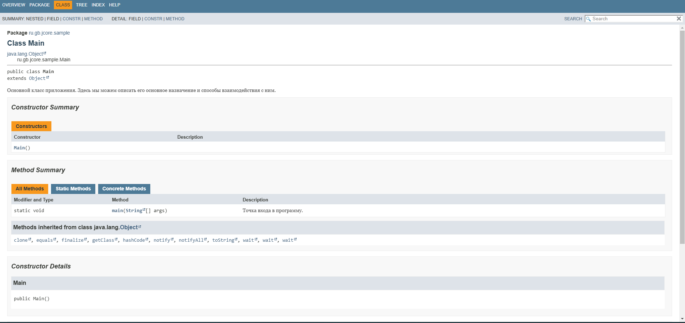
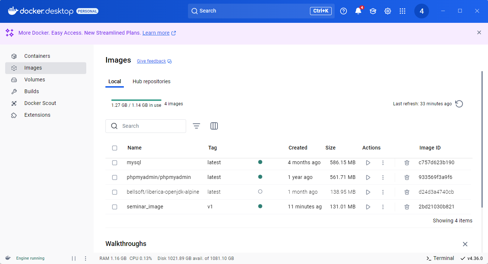
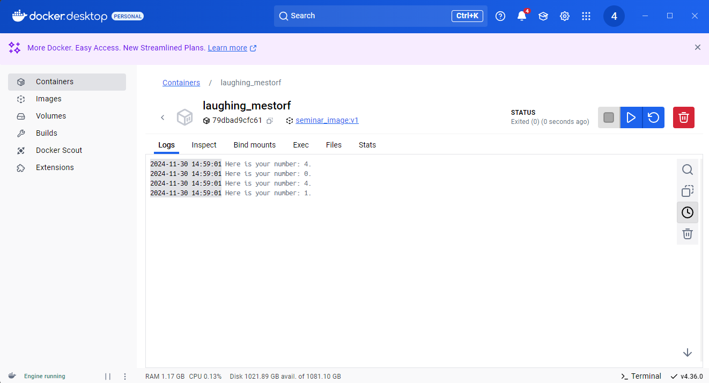

Создать проект из трёх классов (основной с точкой входа и два класса в другом пакете),
которые вместе должны составлять одну программу, позволяющую производить четыре
основных математических действия и осуществлять форматированный вывод результатов
пользователю (ИЛИ ЛЮБОЕ ДРУГОЕ ПРИЛОЖЕНИЕ НА ВАШ ВЫБОР, которое просто демонстрирует
работу некоторого механизма). 
Необходимо установить Docker Desktop. Создать Dockerfile, 
позволяющий откопировать исходный код вашего приложения в образ для демонстрации 
работы вашего приложения при создании соответствующего контейнера.
Подобную процедуру мы с вами проделали на уроке, теперь необходимо проделать
данную процедуру самостоятельно.

результат создания документации: 

результат создания docker образа seminar image: 

вывод работы docker образа: 